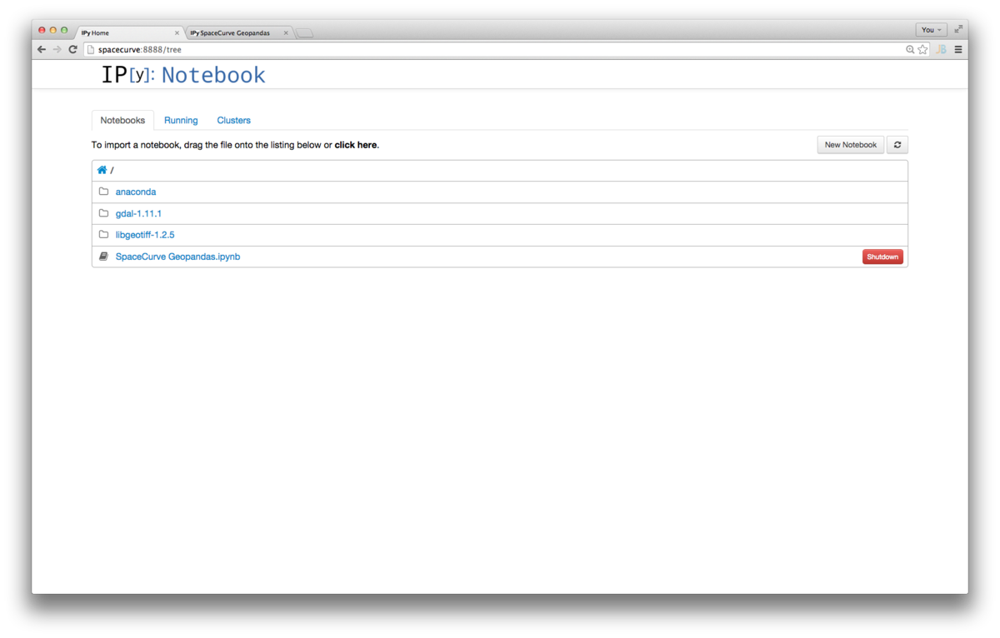
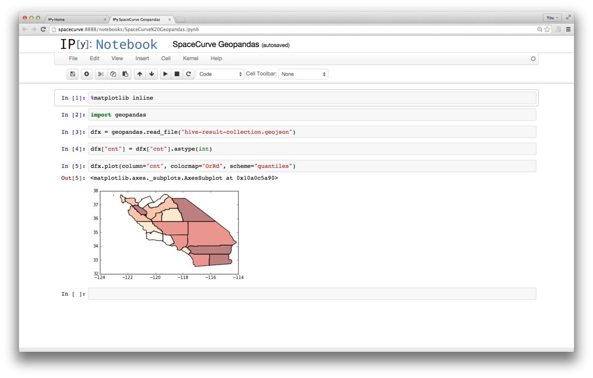

# Installing GeoPandas and IPython Notebook in Centos 6.5

The dependency graph for installing [Matplotlib](http://matplotlib.org/) and
[GeoPandas](http://geopandas.org/) for geospatial visualization requires newer libraries
than what is available in [EPEL](https://fedoraproject.org/wiki/EPEL) (Extra Packages for
Enterprise Linux) on Centos 6.5. To minimize the number of out-of-tree installable
archives we will use the [Anaconda Python
distribution](http://docs.continuum.io/anaconda/) from [Continuum](http://continuum.io/)
which includes [numpy](http://www.numpy.org/)/[scipy](http://www.scipy.org/)/matplotlib
etc. Only two packages need to be installed on the base system to support GeoPandas
specifically, the rest, including Anaconda, can run from within the user's home directory.

**TK: It should be possible to install `libgeotiff` and `gdal` inside of the Anaconda
directory**

This install guide was created against the SpaceCurve Quickstart VM upgraded to Centos 6.5

## Archives

We will need three archives before downloading the rest of the packages via [pip](http://en.wikipedia.org/wiki/Pip_(package_manager)).

```
wget http://download.osgeo.org/geotiff/libgeotiff/libgeotiff-1.2.5.tar.gz
wget http://download.osgeo.org/gdal/1.11.1/gdal-1.11.1.tar.gz
wget http://09c8d0b2229f813c1b93-c95ac804525aac4b6dba79b00b39d1d3.r79.cf1.rackcdn.com/Anaconda-2.1.0-Linux-x86_64.sh
```

`sha1sum` of the above files

```
38b10070374636fedfdde328ff1c9f3c6e8e581f  libgeotiff-1.2.5.tar.gz
e2c67481932ec9fb6ec3c0faadc004f715c4eef4  gdal-1.11.1.tar.gz
95d87bd759a529fcdbd8c6ffa961a843031367ce  Anaconda-2.1.0-Linux-x86_64.sh
```

## Install Steps

1. $ `yum groupinstall "Development Tools"`

    This pulls in gcc,gfortran,make,etc.

2. $ `adduser geotiff; echo "geotiff:geotiff" | chpasswd; usermod -a -G wheel geotiff`

    This is the user account we will install Anaconda into and run IPython
    Notebook from. Only `libgeotiff` and `gdal` need to be installed into
    the base system. Everything else will be installed with Anaconda and pip
    in the geotiff home directory.

3. $ `echo "/usr/local/lib" >> /etc/ld.so.conf.d/locallib.conf`

	This allows us to link against the shared libraries that `libgeotiff` and `gdal`
    install into `/usr/local/lib`

4. Install libgeotiff-1.2.5

        $ yum install libtiff-devel
        # depedency for libgeotiff
        $ tar xvf libgeotiff-1.2.5.tar.gz 
        $ ./configure; make -j4
        $ sudo make install
        $ sudo ldconfig

5. Install gdal-1.11.1

        $ tar xvf gdal-1.11.1.tar.gz 
        $ ./configure --with-geotiff=yes; make -j4
        $ sudo make install
        $ sudo ldconfig
   
        
6. Install Anaconda

    	$ bash Anaconda-2.1.0-Linux-x86_64.sh
        follow the defaults
		enable Anaconda in your bash_profile

7. Confirm Anaconda works

        logout; login, pip and python should be in path
        $ which python
        ~/anaconda/bin/python
        $ which pip
        ~/anaconda/bin/pip

8. Install PySAL and GeoPandas

        $ pip install fiona PySAL
        $ pip install geopandas

9. Create ipython notebook server with an open port enabling host to guest communication 

        $ ipython profile create nbserver
        # c.NotebookApp.ip = ''
        # security hole, anyone on local net can connect
        # for this demo, I am assuming the VM is running with
        # host only networking
        $ vim ~/.ipython/profile_nbserver/ipython_notebook_config.py

    See [ipython public server](http://ipython.org/ipython-doc/1/interactive/public_server.html)
    for instructions on how to setup passwords and SSL for IPython Notebook.
        
# Launch ipython notebook

[IPython Notebook](http://ipython.org/notebook.html) allows us to have a rich,
interactive Python shell running in the SpaceCurve Quickstart VM accessible via
a browser on our host OS.

Launch the IPython server on the SpaceCurve VM with:

`$ ipython notebook --profile=nbserver`

You should see:

```
2014-10-05 12:34:27.820 [NotebookApp] Using existing profile dir: u'/home/geotiff/.ipython/profile_nbserver'
2014-10-05 12:34:27.827 [NotebookApp] Using MathJax from CDN: https://cdn.mathjax.org/mathjax/latest/MathJax.js
2014-10-05 12:34:27.841 [NotebookApp] CRITICAL | WARNING: The notebook server is listening on all IP addresses and not using encryption. This is not recommended.
2014-10-05 12:34:27.841 [NotebookApp] CRITICAL | WARNING: The notebook server is listening on all IP addresses and not using authentication. This is highly insecure and not recommended.
2014-10-05 12:34:27.842 [NotebookApp] Serving notebooks from local directory: /home/geotiff
2014-10-05 12:34:27.842 [NotebookApp] 0 active kernels 
2014-10-05 12:34:27.842 [NotebookApp] The IPython Notebook is running at: http://[all ip addresses on your system]:8888/
2014-10-05 12:34:27.842 [NotebookApp] Use Control-C to stop this server and shut down all kernels (twice to skip confirmation).
2014-10-05 12:34:27.843 [NotebookApp] WARNING | No web browser found: could not locate runnable browser.
```

Copy the IPython notebook and the example [GeoJSON](http://en.wikipedia.org/wiki/GeoJSON) that is in this directory over to the SpaceCurve VM

`scp SpaceCurve\ Geopandas.ipynb hive-result-collection.geojson geotiff@spacecurve:`

On the host machine navigate to http://spacecurve:8888/ and open the `SpaceCurve Geopandas.ipynb` by clicking on it in the browser.



When the notebook is loaded the code will run and the data will be plotted inline.




