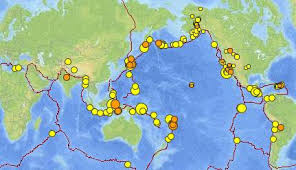
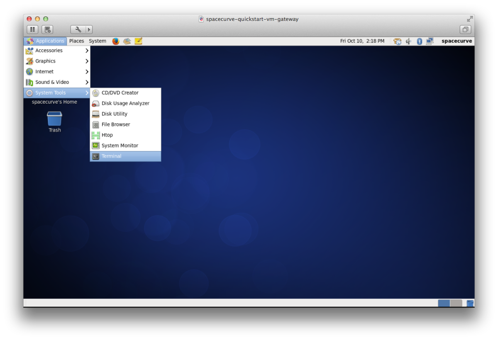
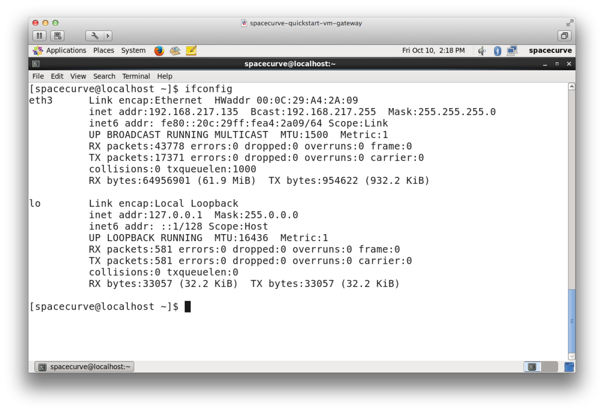
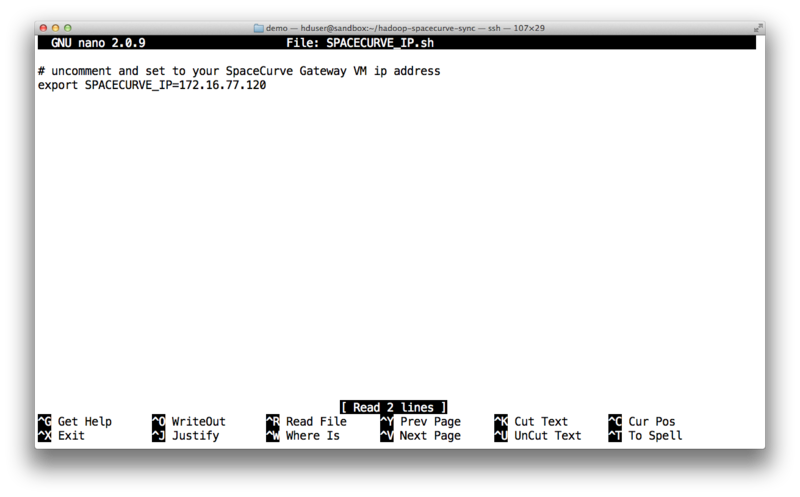
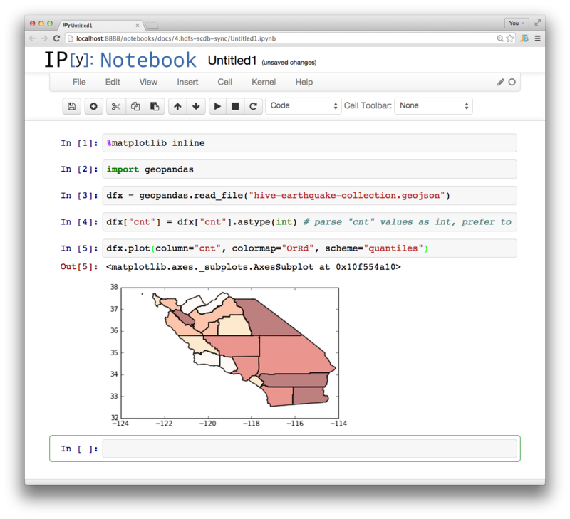

# Front Matter

This document outlines the mechanics of export/import between SpaceCurve and
Hadoop so that the SpaceCurve data can be accessible to the Hadoop stack.

[Hadoop](http://en.wikipedia.org/wiki/Apache_Hadoop) is the defacto open source
standard for processing large amounts of data (gigabytes to petabytes) on 
clusters of commodity hardware. Hadoop contains two major systems the
compute layer which is managed by [Yarn](http://hadoop.apache.org/docs/current/hadoop-yarn/hadoop-yarn-site/YARN.html)
and the storage layer, [Hadoop Distributed File System](http://hortonworks.com/hadoop/hdfs/) (HDFS).

This document is for anyone that would like to understand and implement parallel data
synchronization between SpaceCurve and Hadoop/HDFS. By integrating at the HDFS layer
we enable all systems and tools that interact with HDFS to be utilized in their
normal workflows without being tied directly to SpaceCurve. Bidirectional HDFS syncing
opens up SpaceCurve data to the most possible users of the Hadoop ecosystem ([MapReduce](http://hadoop.apache.org/docs/current/hadoop-mapreduce-client/hadoop-mapreduce-client-core/MapReduceTutorial.html#Overview), 
[Pig](http://en.wikipedia.org/wiki/Pig_(programming_tool)), [Hive](http://en.wikipedia.org/wiki/Apache_Hive),
[Streaming](http://hadoop.apache.org/docs/current/hadoop-mapreduce-client/hadoop-mapreduce-client-core/HadoopStreaming.html)
and [Spark](https://spark.apache.org/)).

We will walk through the process and implementation of
exporting earthquake data from SpaceCurve via [grids](http://discreteglobalgrids.org/),
processing it with [Apache Hive](http://en.wikipedia.org/wiki/Apache_Hive) to
find the total number of occurrences by California county and then importing the
results back into SpaceCurve. 

This document assumes some familiarity with the command line and virtualization
products ([VMWare Fusion](https://www.vmware.com/products/fusion-pro/features.html)
or [Workstation](http://www.vmware.com/products/workstation)) as we will using
two VMs, SpaceCurve QuickStart VM and [Hortonworks Sandbox](http://hortonworks.com/products/hortonworks-sandbox/).




## How it works

This section gives a high level overview of the tutorial, with following sections
diving into the details of the individual steps.

SpaceCurve is a distributed, clustered, geospatial database with a streaming
HTTP interface, for most of this tutorial we will be using
[curl](http://en.wikipedia.org/wiki/CURL) to export and import data.

The curl command:

```
$ curl -s -H "Accept: application/noheader+json" 127.1:8080/ArcGIS/schema/earthquakes \
	| hdfs dfs -put /path/on/hdfs/earthquakes.json
```

can extract all the data from the `earthquakes` table and copy it to HDFS.
But this will only operate as fast as the combination of a single SpaceCurve
and HDFS node. By partitioning the data using the [Discrete Global
Grids](http://discreteglobalgrids.org/) and executing many such queries in
parallel, one for each grid cell, we can leverage the horizontal scaling
capabilities of SpaceCurve and HDFS. For small data sets of less than a
gigabyte this technique is not needed as the startup costs for the MapReduce
job are larger than the copy itself. While we are using a reduced data set for
expediency, we will be using a parallel [MapReduce job](src/hadoop-spacecurve-sync/1-dfs-sync)
for exporting data from SpaceCurve.

Once the data resides on HDFS we will configure Hive tables for [California
counties](src/hadoop-spacecurve-sync/2-hive-job/1-esri-setup.sql) and
[Earthquakes](src/hadoop-spacecurve-sync/2-hive-job/2-earthquake.sql) that
create a SQL structure over the underlying data using [GeoJsonSerde](https://github.com/SpaceCurve/spatial-framework-for-hadoop/blob/spacecurve-geojson-serdes/hive/src/main/java/com/esri/hadoop/hive/serde/GeoJsonSerde.java)
to allow us to use the raw GeoJSON returned from SpaceCurve.

[Apache Hive](http://hortonworks.com/hadoop-tutorial/how-to-process-data-with-apache-hive/)
is a SQL engine that runs on top of Hadoop as a user level program, meaning
any user with access to Hadoop can run Hive, it doesn't need to be installed
on the cluster. Hive works by defining mappings for data on HDFS to SQL
tables, user queries are turned into Java MapReduce programs that run as a
sequence of `map` and `reduce` tasks orchestrated by the [Hive shell](https://cwiki.apache.org/confluence/display/Hive/LanguageManual+Cli).
The SQL abstraction is an excellent fit for the
[MapReduce](http://en.wikipedia.org/wiki/MapReduce) paradigm allowing the end
user to concentrate on processing her data. Like most SQL engines, Hive has a
mechanism for running user code as part of a query called [Hive
UDFs](https://cwiki.apache.org/confluence/display/Hive/LanguageManual+UDF)
and we will be using the [ESRI Spatial Framework for
Hadoop](https://github.com/Esri/spatial-framework-for-hadoop) to use the following
GIS functions:


* ST_Point
* ST_Contains
* ST_AsText
* [ST_Within](http://postgis.org/docs/ST_Within.html)
* ST_AsGeoJson

Configured in this way, Hive with the ESRI UDFs feels a lot like SpaceCurve or
PostGIS.

Once the code and the data has been configured in Hive, the query looks like any
other SQL GIS query, [hadoop-spacecurve-sync/2-hive-job/3-job.sql](src/hadoop-spacecurve-sync/2-hive-job/3-job.sql)

```
create table job2_earthquake_agg as
SELECT name, ST_AsGeoJson(boundaryshape) as geojson_boundary, count(*) cnt FROM counties
JOIN earthquake
WHERE ST_Contains(counties.boundaryshape, earthquake.shape)
GROUP BY counties.name, counties.boundaryshape
ORDER BY cnt desc;
```

The above query finds the count of earthquakes within each California county.
We use the [county data](https://github.com/Esri/gis-tools-for-hadoop/blob/master/samples/data/counties-data/california-counties.json) from
the [esri gis tools for hadoop](https://github.com/Esri/gis-tools-for-hadoop) saving the
result to a Hive table on HDFS @ `hdfs:///apps/hive/warehouse/job2_earthquake_agg/000000_0`.
By using `ST_AsGeoJson` from within the query, we have access to an ASCII
representation of the geometry instead internal binary format used by the
ESRI tools making it much easier to generate valid GeoJSON.

The native format for data stored in Hive is to delimit the columns with
ctrl-a chars (literal 1 byte). Since the amount of data in the resulting
table is only 21 rows, to sync the output of the job to SpaceCurve we run the
HDFS `cat` command through a [Python filter](src/hadoop-spacecurve-sync/3-hive-to-scdb/geo_filter.py)
that converts each Hive row into a GeoJSON object that is [POSTed](src/hadoop-spacecurve-sync/3-hive-to-scdb/upload-direct.sh) into
SpaceCurve via `curl`. Had the resulting data been on the order of gigabytes, we
could have constructed an analogous job to the [streaming mapreduce job](src/hadoop-spacecurve-sync/1-dfs-sync/)
used to copy data into HDFS, only with the source and the destinations reversed.

## VM Setup

**TK: possibly extract this to another doc**

In this demo we will be run using two VMs:

1. SpaceCurve QuickStart VM for the SpaceCurve database (Earthquake and Grid data)
2. [Hortonworks Sandbox VM](http://hortonworks.com/products/hortonworks-sandbox/)
   for Hadoop, Hive and HDFS.
    
**TK: screenshots of Hortonworks VM extraction and setup**	
	
And two archives:

1. `spacecurve-prep.tar.gz` for loading earthquake and grid data into SpaceCurve
2. `hadoop-spacecurve-sync.tar.gz` for export, Hive job and import to SpaceCurve

### SpaceCurve Quickstart VM Setup

1. unpack, login, start SpaceCurve, see SpaceCurve QuickStart VM instructions
    
### Hortonworks Sandbox VM Setup

1. unpack and start
2. login (root/hadoop)
    1. adduser hduser, chpasswd hduser (I used hduser/hduser)
    2. yum install jq (for pretty printing json data)
    2. yum install nano
3. logout, login as hduser
4. create hdfs home directory for hduser

Type:

```
$ hdfs dfs -ls /user
```

Output:

```
Found 7 items
drwxrwx---   - ambari-qa hdfs           0 2014-04-21 07:26 /user/ambari-qa
drwxr-xr-x   - guest     guest          0 2014-04-22 07:21 /user/guest
drwxr-xr-x   - hcat      hdfs           0 2014-04-21 07:23 /user/hcat
drwx------   - hive      hdfs           0 2014-04-21 07:17 /user/hive
drwxr-xr-x   - hue       hue            0 2014-04-22 07:21 /user/hue
drwxrwxr-x   - oozie     hdfs           0 2014-04-21 07:18 /user/oozie
drwxr-xr-x   - root      root           0 2014-04-22 07:20 /user/root    
```

Next we need to create the home directory for the `hduser`, all the data exported
from SpaceCurve and the job output will reside here.

Type:

```
$ hdfs dfs -mkdir /user/hduser
```

Running the bare command `hdfs dfs -ls` should not return an error. 

### Archive Generation and Sync

The two archives are generated from the [src dir](src) is this repository via a Makefile.
Once your VMs are up and you have their IP addresses, you can edit the [Makefile](src/Makefile)
to point to your two VMs by replacing `HADOOP_ADDR` and `SPACECURVE_ADDR` with
the names or IP addresses of your two VMs. You can find the IP address by logging
into a VM, opening a terminal window (Applications->System Tools->Terminal)






Type:

`$ ifconfig`

Output:

```
eth0      Link encap:Ethernet  HWaddr 00:0C:29:5F:1C:2C  
          inet addr:192.168.217.133  Bcast:192.168.217.255  Mask:255.255.255.0
          inet6 addr: fe80::20c:29ff:fe5f:1c2c/64 Scope:Link
          UP BROADCAST RUNNING MULTICAST  MTU:1500  Metric:1
          RX packets:14715 errors:0 dropped:0 overruns:0 frame:0
          TX packets:5491 errors:0 dropped:0 overruns:0 carrier:0
          collisions:0 txqueuelen:1000 
          RX bytes:13143733 (12.5 MiB)  TX bytes:2035533 (1.9 MiB)
```

Your IP address will be the value after `addr` on line:

```
          inet addr:192.168.217.133  Bcast:192.168.217.255  Mask:255.255.255.0
```

After editing the `Makefile` with the IP addresses of your VMs, generate the
archives and sync them.

Type:

`$ make package sync`

Output:

```
... output elided ...
a spacecurve-prep/DGG/grid.sql
a spacecurve-prep/DGG/load_dgg.sh
a spacecurve-prep/DGG/orient.py
scp hadoop-spacecurve-sync.tar.gz hduser@192.168.217.133:
hadoop-spacecurve-sync.tar.gz                                     100% 1236KB   1.2MB/s   00:00    
scp spacecurve-prep.tar.gz spacecurve@spacecurve:
spacecurve-prep.tar.gz                                            100%  537KB 536.9KB/s   00:00    
```

At this point you should have one archive on each VM:

	Hortonworks Sandbox VM / hadoop-spacecurve-sync.tar.gz
	SpaceCurve QuickStart VM / spacecurve-prep.tar.gz

# SpaceCurve Prep and Data Load

This phase occurs on the SpaceCurve VM. 

We will ssh into SpaceCurve, unpack the archive and run the script which will

1. Restore SpaceCurve to a blank state, THIS WILL DESTROY any data in your
existing database.

2. Load in the earthquake data from the ~/VM data folder that already exists
on your SpaceCurve QuickStart VM.

3. Create a schema for the results from our Hadoop/Hive job.


Type:


```    
$ ssh spacecurve@<SPACECURVE IP>
; ## login with password 'spacecurve'
$ tar xvf spacecurve-prep.tar.gz
```

Output:

``` 
spacecurve-prep/
spacecurve-prep/1-earthquake-load.sh
spacecurve-prep/2-global-grid-load.sh
spacecurve-prep/3-hive-prep.sh
spacecurve-prep/DGG/
spacecurve-prep/hive_result/
spacecurve-prep/README.md
spacecurve-prep/spacecurve-reset.sh
spacecurve-prep/wholething.sh
spacecurve-prep/hive_result/hive_result.sql
spacecurve-prep/hive_result/load_schema.sh
spacecurve-prep/DGG/grid.json.old
spacecurve-prep/DGG/grid.sql
spacecurve-prep/DGG/load_dgg.sh
spacecurve-prep/DGG/orient.py
```

We will cd into `spacecurve-prep` and run `wholething.sh` which will complete
steps 1 through 3 above.

Type:

```
$ cd spacecurve-prep
$ ./wholething.sh
```

Output:


```
DESTROY all SpaceCurve data??
1) Yes
2) No
stopping spacecurve
~/VM ~/spacecurve-prep
cleaning
init
[23236] starting /opt/spacecurve/scdb/1.2.0.0-202_c0ed0_HEAD_release/bin//master -y -m127.0.0.1 -n0 -c/opt/spacecurve/scdb/1.2.0.0-202_c0ed0_HEAD_release/pysrc/scdb/../../conf/master.properties -d/var/opt/spacecurve/scdb/data/node_0 -C
==> Checking status...
[23269] running /opt/spacecurve/scdb/1.2.0.0-202_c0ed0_HEAD_release/bin//front -y -m127.0.0.1 -n100 -c/opt/spacecurve/scdb/1.2.0.0-202_c0ed0_HEAD_release/conf//front.properties
[23267] running /opt/spacecurve/scdb/1.2.0.0-202_c0ed0_HEAD_release/bin//worker -y -m127.0.0.1 -n1 -c/opt/spacecurve/scdb/1.2.0.0-202_c0ed0_HEAD_release/conf//worker.properties -d/var/opt/spacecurve/scdb/data/node_1/engine_0
[23236] running /opt/spacecurve/scdb/1.2.0.0-202_c0ed0_HEAD_release/bin//master -y -m127.0.0.1 -n0 -c/opt/spacecurve/scdb/1.2.0.0-202_c0ed0_HEAD_release/pysrc/scdb/../../conf/master.properties -d/var/opt/spacecurve/scdb/data/node_0 -C
[23268] running /opt/spacecurve/scdb/1.2.0.0-202_c0ed0_HEAD_release/bin//worker -y -m127.0.0.1 -n2 -c/opt/spacecurve/scdb/1.2.0.0-202_c0ed0_HEAD_release/conf//worker.properties -d/var/opt/spacecurve/scdb/data/node_2/engine_0
[23222] exited /opt/spacecurve/scdb/1.2.0.0-202_c0ed0_HEAD_release/bin//master -y -m127.0.0.1 -n0 -c/opt/spacecurve/scdb/1.2.0.0-202_c0ed0_HEAD_release/conf//master.properties -d/var/opt/spacecurve/scdb/data/node_0
==> OK
... output elided ...
schema.hiveresult
schema.grid
schema.earthquakes
```

You should see the three schema's above. To confirm that the earthquake and grid
data is in SpaceCurve you can either, from within SpaceCurve VM,

Type:

```
$ curl -s 'http://localhost:8080/ArcGIS/select%20*%20from%20schema.earthquakes;' | wc -l
```

Output:

```
17939
```

or load the url, http://SPACECURVE:8080/ArcGIS/schema/earthquakes in your browser.

To view the first record (from inside the SCDB VM)

Type:

```
$ curl -s -H "Accept: application/noheader+json" 127.1:8080/ArcGIS/schema/earthquakes | jq "." | more
```

Output:

```{.json}
{
  "geometry": {
    "type": "Point",
    "coordinates": [
      -67.6095,
      17.5501
    ]
  },
  "properties": {
    "depth": "38",
    "dmin": "0.65666847",
    "gap": "248.4",
    "id": "pr13365008",
    "latitude": "17.5501",
    "longitude": "-67.6095",
    "mag": "3.2",
    "magType": "Md",
    "net": "pr",
    "nst": "14",
    "place": "65km SW of Pole Ojea, Puerto Rico",
    "rms": "0.4",
    "time": "2013-12-31T23:15:12.700Z",
    "type": "earthquake",
    "updated": "2014-02-28T08:44:15.000Z"
  },
  "type": "Feature"
}
...
```

# Hadoop Data Load and Job

At this point we have two VMs running, we created the two archives and have setup
the SpaceCurve VM with

* Earthquake data (reusing the existing ~/VM example dataset)
* Discrete Global Grid Data for parallelizing the export
* Output schema for results from Hive

The rest of the tutorial will occur on the Hortonworks VM.

We will [SSH](http://en.wikipedia.org/wiki/Secure_Shell) into the Hortonworks VM,
unpack the archive and run three scripts that will:

1. Sync data from SpaceCurve to HDFS using a MapReduce job. [stream-sync.sh](src/hadoop-spacecurve-sync/1-dfs-sync/stream-sync.sh) 
2. Create Hive schemas, run Hive job on cluster. [whole-thing.sh](src/hadoop-spacecurve-sync/2-hive-job/whole-thing.sh)
3. Sync data from HDFS to SpaceCurve [upload-direct.sh](src/hadoop-spacecurve-sync/3-hive-to-scdb/upload-direct.sh) 
    
## Login and Unpack

Login to the Hortonworks VM (from now on HVM)

Type:

```
$ ssh hduser@<HVM>
```

To unpack the archive, type:

```
$ tar xvf hadoop-spacecurve-sync.tar.gz 
```

Output:

```
hadoop-spacecurve-sync/
hadoop-spacecurve-sync/1-dfs-sync/
hadoop-spacecurve-sync/2-hive-job/
hadoop-spacecurve-sync/3-hive-to-scdb/
hadoop-spacecurve-sync/SPACECURVE_IP.sh
hadoop-spacecurve-sync/3-hive-to-scdb/geo_filter.py
hadoop-spacecurve-sync/3-hive-to-scdb/precooked/
hadoop-spacecurve-sync/3-hive-to-scdb/upload-direct.sh
hadoop-spacecurve-sync/3-hive-to-scdb/precooked/hive_data.txt
hadoop-spacecurve-sync/3-hive-to-scdb/precooked/hive_result.geojson
hadoop-spacecurve-sync/3-hive-to-scdb/precooked/upload.sh
hadoop-spacecurve-sync/2-hive-job/1-esri-setup.sql
hadoop-spacecurve-sync/2-hive-job/2-earthquake.sql
hadoop-spacecurve-sync/2-hive-job/3-job.sql
hadoop-spacecurve-sync/2-hive-job/california-counties.json
hadoop-spacecurve-sync/2-hive-job/jars/
hadoop-spacecurve-sync/2-hive-job/sync-jar-hdfs.sh
hadoop-spacecurve-sync/2-hive-job/whole-thing.sh
hadoop-spacecurve-sync/2-hive-job/whole-thing.sql
hadoop-spacecurve-sync/2-hive-job/jars/esri-geometry-api-1.2.jar
hadoop-spacecurve-sync/2-hive-job/jars/spatial-sdk-hive-1.0.3-SNAPSHOT.jar
hadoop-spacecurve-sync/2-hive-job/jars/spatial-sdk-json-1.0.3-SNAPSHOT.jar
hadoop-spacecurve-sync/1-dfs-sync/control-dir/
hadoop-spacecurve-sync/1-dfs-sync/count-url.sh
hadoop-spacecurve-sync/1-dfs-sync/dgg.py
hadoop-spacecurve-sync/1-dfs-sync/gen_control.py
hadoop-spacecurve-sync/1-dfs-sync/mapper.py
hadoop-spacecurve-sync/1-dfs-sync/stream-sync.sh
hadoop-spacecurve-sync/1-dfs-sync/xdoop.sh
```

Next we need to configure the IP address for the SpaceCurve database so that
Hadoop can read and write data to it by editing the file `SPACECURVE_IP.sh` in
the newly unpacked archive.

Type:

```
$ cd hadoop-spacecurve-sync
$ nano SPACECURVE_IP.sh
```



Reconfirm that the Hortonworks VM can talk to the SpaceCurve VM by querying the
earthquakes table. The command should work verbatim.

Type:

```
$ source SPACECURVE_IP.sh
$ curl -s "http://$SPACECURVE_IP:8080/ArcGIS/select%20*%20from%20schema.earthquakes;" | wc -l
```

Output:

```
17939
```

## SpaceCurve to HDFS Sync via MapReduce

After configuring the `SPACECURVE_IP` we will now run a MapReduce job that
will query SpaceCurve and extract a set of earthquakes contained within each
grid cell to HDFS. The number of grid cells controls the number of individual
map tasks with each map task creating an earthquake file on HDFS. The resolution of the grid can be used to balance the parallelism
and amount of data handled by each map task. Too small of a grid cell and we
will have lots of small files which is an in efficient use of HDFS and
Hadoop. Too large of a grid cell and parallelism in loading the data will be
reduced. In our case, with our small amount of demo data, we want the sync
job to be as quick as possible so we use only 12 cells. 

In the [1-dfs-sync](src/hadoop-spacecurve-sync/1-dfs-sync/) we will be running
[stream-sync.sh](src/hadoop-spacecurve-sync/1-dfs-sync/stream-sync.sh) which will

1. Generate the control files by querying the Discrete Global Grid Data
2. Launch [mapper.py](src/hadoop-spacecurve-sync/1-dfs-sync/) which will read the
   control files
Type:

```
$ cd 1-dfs-sync
$ ./stream-sync.sh 
```

Output:

```
using 192.168.217.135 for SpaceCurve IP
; ## output elided
...
	Map-Reduce Framework
		Map input records=12
		Map output records=12
		Input split bytes=1692
		Spilled Records=0
		Failed Shuffles=0
		Merged Map outputs=0
		GC time elapsed (ms)=1373
		CPU time spent (ms)=46390
		Physical memory (bytes) snapshot=1531588608
		Virtual memory (bytes) snapshot=10668707840
		Total committed heap usage (bytes)=901775360
	File Input Format Counters 
		Bytes Read=7980
	File Output Format Counters 
		Bytes Written=5436
14/09/25 13:02:39 INFO streaming.StreamJob: Output directory: output/earthquake
Found 13 items
-rw-r--r--   1 hduser hdfs          0 2014-09-25 13:02 output/earthquake/_SUCCESS
-rw-r--r--   1 hduser hdfs        465 2014-09-25 13:02 output/earthquake/part-00000
-rw-r--r--   1 hduser hdfs        458 2014-09-25 13:02 output/earthquake/part-00001
-rw-r--r--   1 hduser hdfs        458 2014-09-25 13:02 output/earthquake/part-00002
-rw-r--r--   1 hduser hdfs        457 2014-09-25 13:02 output/earthquake/part-00003
-rw-r--r--   1 hduser hdfs        455 2014-09-25 13:02 output/earthquake/part-00004
-rw-r--r--   1 hduser hdfs        453 2014-09-25 13:02 output/earthquake/part-00005
-rw-r--r--   1 hduser hdfs        453 2014-09-25 13:02 output/earthquake/part-00006
-rw-r--r--   1 hduser hdfs        451 2014-09-25 13:02 output/earthquake/part-00007
-rw-r--r--   1 hduser hdfs        448 2014-09-25 13:02 output/earthquake/part-00008
-rw-r--r--   1 hduser hdfs        447 2014-09-25 13:02 output/earthquake/part-00009
-rw-r--r--   1 hduser hdfs        446 2014-09-25 13:02 output/earthquake/part-00010
-rw-r--r--   1 hduser hdfs        445 2014-09-25 13:02 output/earthquake/part-00011
-rw-r--r--   1 yarn hdfs    1681941 2014-09-25 13:02 output/job1/06820929319011b9c764268e3a1b05e02f8b6ccc.json
-rw-r--r--   1 yarn hdfs     344426 2014-09-25 13:02 output/job1/1191df658a2382623ffec1ffe1a91edffc960699.json
-rw-r--r--   1 yarn hdfs      43871 2014-09-25 13:02 output/job1/2c8ae32a4ef23f1a4bb4ba51c74b30f4957fb599.json
-rw-r--r--   1 yarn hdfs    1378864 2014-09-25 13:02 output/job1/73f05891f6cd4eb32b33a33c3a85b17644a0a7c7.json
-rw-r--r--   1 yarn hdfs     215373 2014-09-25 13:02 output/job1/7ee298a3f527bf33b272d49d6cf262d811298e5f.json
-rw-r--r--   1 yarn hdfs    1617977 2014-09-25 13:02 output/job1/896193988064001f6dc847b758938408dcf98d64.json
-rw-r--r--   1 yarn hdfs     206712 2014-09-25 13:02 output/job1/95211c5785271bc3eba27b6be740abf48bb6e3b5.json
-rw-r--r--   1 yarn hdfs     179234 2014-09-25 13:02 output/job1/9b260960e9a9712c48d79e52bdf35810b09edbb6.json
-rw-r--r--   1 yarn hdfs     856588 2014-09-25 13:02 output/job1/c690cb8b34e90f2be9200f741d72ca2ae3e5a68b.json
-rw-r--r--   1 yarn hdfs     199545 2014-09-25 13:02 output/job1/c98fbbbf08940d7c239f67796bdc4801e617ab7c.json
-rw-r--r--   1 yarn hdfs     234982 2014-09-25 13:02 output/job1/d81cf1c8226112904008ce9c4ef04ef4743d9af3.json
-rw-r--r--   1 yarn hdfs      97368 2014-09-25 13:02 output/job1/eeb7a7bd4bc73a9c3559ea7e9c99607c993550c5.json
```

We have two output directories on HDFS:

    output/earthquake/...
    output/job1/...

The `output/earthquake` directory contains `stdout` from each task, in our case
we printed the command that was run. You can look at the contents with:

Type:

`$ hdfs dfs -cat output/earthquake/part-00000`

Output:

```
curl -s -H "Accept: application/noheader+json" "http://172.16.77.120:8080/ArcGIS/select%20%2A%20from%20schema.earthquakes%20as%20e%20where%20e.%22geometry%22.st_within%28st_geography%28%27POLYGON%28%28101.25%20-69.094843%2C%20-78.75%20-69.094842%2C%20-123.75%20-35.264389%2C%20-168.75%20-20.905157%2C%20146.25%20-35.26439%2C%20101.25%20-69.094843%29%29%27%29%29%3B" | /usr/bin/hdfs dfs -put - /user/hduser/output/job1/d81cf1c8226112904008ce9c4ef04ef4743d9af3.json
```

Which is the command generated by the control file used as input to the map task.
To see the contents of the generated control files, type:

```
hdfs dfs -cat temp/earthquake/control/control-0000.json | jq "."
```

Output:

```{.json} 
{
  "sql": "select * from schema.earthquakes as e where e.\"geometry\".st_within(st_geography('POLYGON((11.25 20.905157, -33.75 35.26439, -57.844843 0, -33.75 -35.26439, 11.25 -20.905157, 11.25 20.905157))'));",
  "output": "/user/hduser/output/job1/2c8ae32a4ef23f1a4bb4ba51c74b30f4957fb599.json",
  "url_query": "http://172.16.77.120:8080/ArcGIS/select%20%2A%20from%20schema.earthquakes%20as%20e%20where%20e.%22geometry%22.st_within%28st_geography%28%27POLYGON%28%2811.25%2020.905157%2C%20-33.75%2035.26439%2C%20-57.844843%200%2C%20-33.75%20-35.26439%2C%2011.25%20-20.905157%2C%2011.25%2020.905157%29%29%27%29%29%3B",
  "headers": [
    "Accept: application/noheader+json"
  ]
}
```

Each control file corresponds to a grid cell and a map task.

The directory 

The `output/job1/...` directory is the contents of the queries run against SpaceCurve
by each map task. This is verbatim GeoJSON query result.

```hdfs dfs -cat output/job1/06820929319011b9c764268e3a1b05e02f8b6ccc.json | jq "." | more```

```{.json}
{
  "type": "Feature",
  "properties": {
    "updated": "2014-02-28T08:44:08.000Z",
    "type": "earthquake",
    "time": "2013-12-25T23:43:09.400Z",
    "rms": "0.3",
    "place": "49km NE of Punta Cana, Dominican Republic",
    "nst": "10",
    "net": "pr",
    "depth": "75",
    "dmin": "0.4761071",
    "gap": "241.2",
    "id": "pr13359034",
    "latitude": "18.874",
    "longitude": "-68.0491",
    "mag": "3.1",
    "magType": "Md"
  },
  "geometry": {
    "coordinates": [
      -68.0491,
      18.874
    ],
    "type": "Point"
  }
}
```

Now that our data is on HDFS, lets run the Hive job.

## Hive Job

```
cd ..
cd 2-hive-job/
./whole-thing.sh 
syncing jars to hdfs
Found 3 items
-rw-r--r--   1 hduser hdfs     855764 2014-09-25 13:15 /esri/lib/esri-geometry-api-1.2.jar
-rw-r--r--   1 hduser hdfs     164736 2014-09-25 13:15 /esri/lib/spatial-sdk-hive-1.0.3-SNAPSHOT.jar
-rw-r--r--   1 hduser hdfs      18221 2014-09-25 13:15 /esri/lib/spatial-sdk-json-1.0.3-SNAPSHOT.jar
creating tables, processing earthquake and county data
# output elided
...
OK
San Benito	62
Riverside	58
Inyo	53
Imperial	48
San Bernardino	42
San Diego	28
Kern	26
Los Angeles	19
Fresno	16
Santa Clara	16
Monterey	15
Kings	12
San Luis Obispo	8
Tulare	7
Orange	5
San Mateo	5
Ventura	4
Merced	3
Madera	2
Santa Barbara	2
San Francisco	1
Time taken: 12.592 seconds, Fetched: 21 row(s)
should have a 000... file here
Found 1 items
-rw-r--r--   1 hduser hdfs     257725 2014-09-25 13:16 /apps/hive/warehouse/job2_earthquake_agg/000000_0
```

## HDFS to SpaceCurve Sync

```
cd ../3-hive-to-scdb/
./upload-direct.sh 
using 172.16.77.120 for SpaceCurve IP
21
```

### Extract result from SpaceCurve

```
curl -s -H "Accept: application/noheader+json" http://<SPACECURVE IP>:8080/ArcGIS/schema/hiveresult > hive-earthquakes.geojson
# transform into feature collection
jq --slurp '{features:.,type:"FeatureCollection"}' hive-earthquakes.geojson > hive-earthquake-collection.geojson
```

### Visualize in Python

Create an IPython+Geopandas Python environment

```
virtualenv spacecurve-demo.env
source spacecurve-demo/bin/activate

pip install scipy
pip install numpy
pip install PySAL
pip install geopandas
pip install matplotlib
pip install pyzmq
pip install jinja2
pip install tornado
pip install ipython
# launch ipython notebook, will open a browser window
ipython notebook
```

And then open the IPython notebook: `hive-earthquake-visualizer.ipynb`



```
# ipython notebook
%matplotlib inline

import geopandas

dfx = geopandas.read_file("hive-earthquake-collection.geojson")
dfx["cnt"] = dfx["cnt"].astype(int) # parse "cnt" values as int, prefer to handle this upstream but don't want to complicate the jq transform
dfx.plot(column="cnt", colormap="OrRd", scheme="quantiles")
```


----

**TK: END OF NEW DOCUMENT**

----

# Hive

Note: the jars and temporary functions need to be added to your session. Tk:
make persistent?

## Install ESRI

**TK, maybe just ship tar.gz inside of the SpaceCurve Gateway VM that has
everything we need**

```
mkdir esri
cd esri
git clone https://github.com/Esri/gis-tools-for-hadoop.git
git clone https://github.com/Esri/geometry-api-java.git
git clone https://github.com/Esri/spatial-framework-for-hadoop.git
pushd geometry-api-java
mvn package
popd
pushd spatial-framework-for-hadoop
mvn package
popd
find . -name "*.jar"
./spatial-framework-for-hadoop/json/target/spatial-sdk-json-1.0.3-SNAPSHOT.jar
./spatial-framework-for-hadoop/json/target/spatial-sdk-json-1.0.3-SNAPSHOT-javadoc.jar
./spatial-framework-for-hadoop/hive/target/spatial-sdk-hive-1.0.3-SNAPSHOT-javadoc.jar
./spatial-framework-for-hadoop/hive/target/spatial-sdk-hive-1.0.3-SNAPSHOT.jar
./geometry-api-java/target/esri-geometry-api-1.2-sources.jar
./geometry-api-java/target/esri-geometry-api-1.2-javadoc.jar
./geometry-api-java/target/esri-geometry-api-1.2.jar
./geometry-api-java/DepFiles/unittest/junit-4.8.2.jar
./geometry-api-java/DepFiles/public/jackson-core-asl-1.9.11.jar
./geometry-api-java/DepFiles/public/java-json.jar
```

We will be using

```
./geometry-api-java/target/esri-geometry-api-1.2.jar
./spatial-framework-for-hadoop/hive/target/spatial-sdk-hive-1.0.3-SNAPSHOT.jar
./spatial-framework-for-hadoop/json/target/spatial-sdk-json-1.0.3-SNAPSHOT.jar
```

from within Hive to extract [GeoJSON](http://en.wikipedia.org/wiki/GeoJSON) data 
from HDFS and UDFs for doing geometric computation.

The following script makes the jar files we generated available to Hive.
    
```{.bash}
# sync-hdfs.sh 
hdfs dfs -rm -r /esri
hdfs dfs -mkdir -p /esri/lib

hdfs dfs -put ./geometry-api-java/target/esri-geometry-api-1.2.jar /esri/lib
hdfs dfs -put ./spatial-framework-for-hadoop/hive/target/spatial-sdk-hive-1.0.3-SNAPSHOT.jar /esri/lib
hdfs dfs -put ./spatial-framework-for-hadoop/json/target/spatial-sdk-json-1.0.3-SNAPSHOT.jar /esri/lib

hdfs dfs -ls /esri/lib
```

In Hive , 

    tk, remove hcatalog dep
    tk, use ESRI SerDes instead of MetlogHive?
        if using Metlog, describe install https://github.com/mozilla-services/metlog-hive


```
add jar hdfs:///esri/lib/esri-geometry-api-1.2.jar;
add jar hdfs:///esri/lib/spatial-sdk-hive-1.0.3-SNAPSHOT.jar;
add jar hdfs:///esri/lib/spatial-sdk-json-1.0.3-SNAPSHOT.jar;

#TK remove these, use GeoJSON serdes
#add jar /home/hduser/apache-hive-0.13.1-bin/hcatalog/share/hcatalog/hive-hcatalog-core-0.13.1.jar;

#dd jar hdfs:///metlog/lib/MetlogHive.jar;
#create temporary function exjson_tuple as 'org.mozilla.services.json.ExJSONTuple';


create temporary function ST_Point as 'com.esri.hadoop.hive.ST_Point';
create temporary function ST_Contains as 'com.esri.hadoop.hive.ST_Contains';
```    

## Create tables

### Counties

This data originates from the [ESRI Tools for Hadoop](https://github.com/Esri/gis-tools-for-hadoop/tree/master/samples/data/counties-data) demo.


```{.sql}
drop table counties;

CREATE EXTERNAL TABLE IF NOT EXISTS counties (Area string, Perimeter string, State string, County string, Name string, BoundaryShape binary)                                         
ROW FORMAT SERDE 'com.esri.hadoop.hive.serde.JsonSerde'              
STORED AS INPUTFORMAT 'com.esri.json.hadoop.EnclosedJsonInputFormat'
OUTPUTFORMAT 'org.apache.hadoop.hive.ql.io.HiveIgnoreKeyTextOutputFormat';

load data local inpath '${env:HOME}/esri/gis-tools-for-hadoop/samples/data/counties-data/california-counties.json' overwrite into table counties;
```

```
hive> describe counties;
OK
area                	string              	from deserializer   
perimeter           	string              	from deserializer   
state               	string              	from deserializer   
county              	string              	from deserializer   
name                	string              	from deserializer   
boundaryshape       	binary              	from deserializer   
Time taken: 0.418 seconds, Fetched: 6 row(s)
```

```
hive> select area,perimeter,state,county,name from counties limit 10;
Query ID = hduser_20140913111414_a2e3d42e-7cb0-48a8-a749-3116a1305ef6
Total jobs = 1
Launching Job 1 out of 1
Number of reduce tasks is set to 0 since there's no reduce operator
Starting Job = job_1410476289189_0009, Tracking URL = http://sandbox.hortonworks.com:8088/proxy/application_1410476289189_0009/
Kill Command = /usr/lib/hadoop/bin/hadoop job  -kill job_1410476289189_0009
Hadoop job information for Stage-1: number of mappers: 1; number of reducers: 0
2014-09-13 11:15:10,659 Stage-1 map = 0%,  reduce = 0%
2014-09-13 11:15:17,329 Stage-1 map = 100%,  reduce = 0%, Cumulative CPU 2.13 sec
MapReduce Total cumulative CPU time: 2 seconds 130 msec
Ended Job = job_1410476289189_0009
MapReduce Jobs Launched: 
Job 0: Map: 1   Cumulative CPU: 2.13 sec   HDFS Read: 704247 HDFS Write: 522 SUCCESS
Total MapReduce CPU Time Spent: 2 seconds 130 msec
OK
0.0125060450672465	0.467705500978816	06	075	San Francisco
0.566179887404993	4.76814917576764	06	039	Madera
0.121590982187282	2.08407059165341	06	081	San Mateo
2.22720773921709E-4	0.0551155630628188	06	075	San Francisco
0.518258351200023	3.44214780535354	06	047	Merced
1.57281998092049	8.71737525631636	06	019	Fresno
0.342963319525509	3.37378357993653	06	085	Santa Clara
2.66486584605939	8.72857897522841	06	027	Inyo
0.117166631029334	2.18921397922584	06	087	Santa Cruz
0.362891155992015	3.47630681843105	06	069	San Benito
Time taken: 22.645 seconds, Fetched: 10 row(s)
```

### Imported SCDB Earthquake Data

The earthquake data we extracted from SCDB is stored on HDFS under `/user/hduser/output/job1/`
in GeoJSON format. We need to use the ESRI SerDes (ser)

```{.sql}
drop table earthquake_raw_text;
create external table earthquake_raw_text (
    json string
)
location '/user/hduser/output/job1/';
```

Confirm we can access the raw line oriented GeoJSON

```
hive> select * from earthquake_raw_text limit 1;
OK
{"geometry":{"type":"Point","coordinates":[74.3548,-28.1597]},"properties":{"depth":"17.1","dmin":"38.721","gap":"80","id":"usb000m2q0","latitude":"-28.1597","longitude":"74.3548","mag":"4.7","magType":"mb","net":"us","nst":"","place":"Mid-Indian Ridge","rms":"0.66","time":"2013-12-30T15:19:10.020Z","type":"earthquake","updated":"2014-02-28T08:44:13.000Z"},"type":"Feature"}
Time taken: 0.728 seconds, Fetched: 1 row(s)
```

## Create view

Create a view over this table with the fields extracted out.

```
hive> describe test_view_metlog;
OK
time                    string                                      
rms                     double                                      
place                   string                                      
depth                   double                                      
id                      string                                      
latitude                double                                      
longitude               double                                      
mag                     string                                      
geom_lat                double                                      
geom_long               double                                      
Time taken: 0.093 seconds, Fetched: 10 row(s)
```

```{.sql}
create view test_view_metlog as
    select
        b.time,
        cast(b.rms as double) as rms,
        b.place,
        cast(b.depth as double) as depth,
        b.id,
        cast(b.latitude as double) as latitude,
        cast(b.longitude as double) as longitude,
        b.mag,
        cast(b.geom_lat as double) as geom_lat,
        cast(b.geom_long as double) as geom_long
    from test_metlog
    lateral view exjson_tuple(test_metlog.json, "properties.time", "properties.rms", "properties.place", "properties.depth", "properties.id", "properties.latitude", "properties.longitude", "properties.mag", "geometry.coordinates[1]", "geometry.coordinates[0]") b as
        time, rms, place, depth, id, latitude, longitude, mag, geom_lat, geom_long;
```

Confirm it works

```
hive> select * from test_view_metlog;
...
2013-07-02T20:04:55.500Z        1.3     45km N of San Antonio de los Cobres, Argentina  192.8   usb000i576      -23.811 -66.402 5.6-23.811 -66.402
Time taken: 20.237 seconds, Fetched: 22592 row(s)
```

## Join Data

```{.sql}
SELECT counties.name, count(*) cnt FROM counties
JOIN earthquakes
WHERE ST_Contains(counties.boundaryshape, ST_Point(earthquakes.longitude, earthquakes.latitude))
GROUP BY counties.name
ORDER BY cnt desc;
```

Result

```
OK
Kern    36
San Bernardino  35
Imperial        28
Inyo    20
Los Angeles     18
Riverside       14
Monterey        14
Santa Clara     12
Fresno  11
San Benito      11
San Diego       7
Santa Cruz      5
San Luis Obispo 3
Ventura 3
Orange  2
San Mateo       1
Time taken: 49.778 seconds, Fetched: 16 row(s)
```

# Appendix

## Debugging Techniques

### Querying SCDB with a browser

For many of the datasets we are using they won't overload a browser with a lot
of memory. Simply typing in the query to the URL bar is fairly effective.

```
http://sc:8080/ArcGIS/select%20*%20from%20schema.earthquakes;
```

You will notice that the result comes back with an included header and inside
of a JS array

```{.json}
[
  {
    "lower_bound": "0xa17d5b1c389f29dd",
    "request_id": "9678092828265154930",
    "upper_bound": "0xa17d5b1c389f29df"
  },
  {
    "geometry": {
      "type": "Point",
      "coordinates": [
        -67.6095,
        17.5501
      ]
    },
    "properties": {
      "depth": "38",
      "dmin": "0.65666847",
      "gap": "248.4",
      "id": "pr13365008",
      "latitude": "17.5501",
      "longitude": "-67.6095",
      "mag": "3.2",
      "magType": "Md",
      "net": "pr",
      "nst": "14",
      "place": "65km SW of Pole Ojea, Puerto Rico",
      "rms": "0.4",
      "time": "2013-12-31T23:15:12.700Z",
      "type": "earthquake",
      "updated": "2014-02-28T08:44:15.000Z"
    },
    "type": "Feature"
  }
]
```

### Querying SCDB with `curl`

To retrieve data in a format that is easier to load, use `curl` with an alternative
header.

```{.bash}
curl -s -H "Accept: application/noheader+json" \
    "http://sc:8080/ArcGIS/SELECT%20*%20FROM%20schema.earthquakes%20WHERE%20%22geometry%22.ST_Within(ST_Geography('POLYGON%20((-80.224%2025.788,%20-66.067%2018.45,%20-64.783%2032.300,%20-80.224%2025.788))'));" \
    | wc -l
# 208 records
```

Where for the format is now (pretty printed with [JQ](http://stedolan.github.io/jq/))

```{.bash}
curl -s -H "Accept: application/noheader+json" \
    "http://sc:8080/ArcGIS/select%20*%20from%20schema.earthquakes;" \
    | jq "."
```    

Where for the format is now (pretty printed with [JQ](http://stedolan.github.io/jq/))


```{.json}
{
  "geometry": {
    "type": "Point",
    "coordinates": [
      -67.3805,
      19.245
    ]
  },
  "properties": {
    "depth": "10",
    "dmin": "1.07258845",
    "gap": "248.4",
    "id": "pr13179002",
    "latitude": "19.245",
    "longitude": "-67.3805",
    "mag": "2.7",
    "magType": "Md",
    "net": "pr",
    "nst": "6",
    "place": "88km NNW of San Antonio, Puerto Rico",
    "rms": "0.28",
    "time": "2013-06-28T05:57:37.000Z",
    "type": "earthquake",
    "updated": "2013-07-07T17:28:50.791Z"
  },
  "type": "Feature"
}
```

## Mechanics of Syncing

### Streaming MapReduce Job

Files that makeup job

```
control-dir
ddg.py
ddg.pyc
gen_control.py
mapper.py
stream-sync.sh
```
----

```{.bash .numberLines}
rm control-dir/*.json

hdfs dfs -rm -r output/job1
hdfs dfs -rm -r output/earthquake
hdfs dfs -rm -r temp/earthquake
hdfs dfs -mkdir -p temp/earthquake/control

python gen_control.py job1 4h1 1000

hdfs dfs -copyFromLocal control-dir/*.json temp/earthquake/control

hdfs dfs -ls temp/earthquake/control

hadoop jar ~/hadoop/share/hadoop/tools/lib/hadoop-streaming-2.4.1.jar \
    -D mapreduce.job.reduces=0 \
    -input temp/earthquake/control \
    -output output/earthquake \
    -mapper mapper.py \
    -file mapper.py

hdfs dfs -ls output/earthquake
hdfs dfs -ls output/*.json

```

1. Lines 1-6 remove the output from the previous job
2. `gen_control.py` queries SCDB and extracts grid data, **TK: needs to use
   the polygon**
3. Line 10, copy the control files to HDFS, each control files corresponds to
   AT LEAST one map job.
4. Line 14, launch the job, copying data from SCDB to HDFS

----

#### mapper.py

```{.python}
#!/usr/bin/env python

import sys
import os
import json

for line in sys.stdin:

    control = json.loads(line)
    headers = ' '.join( '-H "%s"' % (x,) for x in control['headers'])
    command = "curl -s %s %s | /usr/local/hadoop/bin/hdfs dfs -put - %s" % \
        (headers, control['query'], control['output'])
    print command
    os.system(command)
```

----

#### Control Files

```{.json}
{
  "headers": [
    "Accept: application/noheader+json"
  ],
  "output": "/user/hduser/output/job1/515108713528e2650f87970bfcb35d3a8a5d61b3.json",
  "query": "http://sc:8080/ArcGIS/select%20%2A%20from%20schema.earthquakes%20as%20e%20where%20e.%22geometry%22.st_distance%28st_point%28-168.7500%2C%2058.2825%29%29%20%3C%3D%202105905%3B"
}
```

----

#### Console of job

```
14/09/10 08:10:51 WARN streaming.StreamJob: -file option is deprecated, please use generic option -files instead.
14/09/10 08:10:51 WARN util.NativeCodeLoader: Unable to load native-hadoop library for your platform... using builtin-java classes where applicable
packageJobJar: [mapper.py, /tmp/hadoop-hduser/hadoop-unjar826546823810034141/] [] /tmp/streamjob3322418010380204054.jar tmpDir=null
14/09/10 08:10:52 INFO client.RMProxy: Connecting to ResourceManager at /0.0.0.0:8032
14/09/10 08:10:52 INFO client.RMProxy: Connecting to ResourceManager at /0.0.0.0:8032
14/09/10 08:10:53 INFO mapred.FileInputFormat: Total input paths to process : 42
14/09/10 08:10:53 INFO mapreduce.JobSubmitter: number of splits:42
14/09/10 08:10:53 INFO mapreduce.JobSubmitter: Submitting tokens for job: job_1410359786664_0002
14/09/10 08:10:53 INFO impl.YarnClientImpl: Submitted application application_1410359786664_0002
14/09/10 08:10:53 INFO mapreduce.Job: The url to track the job: http://hadt:8088/proxy/application_1410359786664_0002/
14/09/10 08:10:53 INFO mapreduce.Job: Running job: job_1410359786664_0002
14/09/10 08:10:59 INFO mapreduce.Job: Job job_1410359786664_0002 running in uber mode : false
14/09/10 08:10:59 INFO mapreduce.Job:  map 0% reduce 0%
14/09/10 08:11:16 INFO mapreduce.Job:  map 7% reduce 0%
14/09/10 08:11:17 INFO mapreduce.Job:  map 12% reduce 0%
14/09/10 08:11:18 INFO mapreduce.Job:  map 14% reduce 0%
...
```

#### Command each job runs

```
curl -s -H "Accept: application/noheader+json" \
    http://sc:8080/ArcGIS/select%20%2A%20from%20schema.earthquakes%20as%20e%20where%20e.%22geometry%22.st_distance%28st_point%28-147.8448%2C%20-30.0000%29%29%20%3C%3D%202324547%3B \
    | /usr/local/hadoop/bin/hdfs dfs -put - /user/hduser/output/job1/88f894f16edc4fa18068b1e4c6030e8541003421.json
```

#### Output on HDFS

```{.json}
{
  "geometry": {
    "type": "Point",
    "coordinates": [
      -169.9626,
      -27.9736
    ]
  },
  "properties": {
    "depth": "10",
    "dmin": "13.73",
    "gap": "339",
    "id": "usb000ghdd",
    "latitude": "-27.9736",
    "longitude": "-169.9626",
    "mag": "4.3",
    "magType": "mb",
    "net": "us",
    "nst": "9",
    "place": "South Pacific Ocean",
    "rms": "1.72",
    "time": "2013-04-29T06:16:01.550Z",
    "type": "earthquake",
    "updated": "2013-06-05T09:42:58.030Z"
  },
  "type": "Feature"
}
```


<!-- # vim: set tw=78 ts=4 sw=4 et formatoptions+=t wrap nolist : -->
